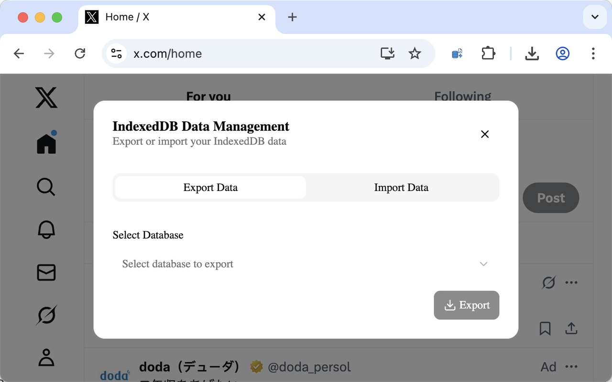

# IDBPort

**IDBPort** is a modern browser extension designed for effortless export and import of IndexedDB data. Say goodbye to export-only tools and welcome a complete data migration and backup solution!

## ✨ Features

- **Effortless Export:**
  - Select IndexedDB databases for specific websites.
  - Export data into easy-to-read and process `.idb` files.
- **Robust Import:**
  - Import data from `.idb` files into specified IndexedDB databases.
- **User-Friendly Interface:**
  - Built with React and shadcn/ui for a beautiful, intuitive, and responsive experience.
  - Clear, step-by-step guidance, no expert knowledge required.
- **Cross-Browser (Target):**
  - Built with WXT, aiming for easy packaging as an extension for major browsers like Chrome, Firefox, Edge, and Safari.
- **Complex Data Type Support (Target):**
  - Correctly handles IndexedDB-supported types like `Date`, `Blob`, `File`, `ArrayBuffer` (serialization & deserialization).

## 🚀 Why IDBPort?

Many existing IndexedDB tools only offer export functionality, making data migration, backup recovery, or syncing data across different environments incomplete. IDBPort aims to fill this gap by providing a comprehensive export _and_ import solution, empowering developers and power users to fully manage their local web application data.

## 🛠️ Installation

Once released to browser extension stores, you can install it as follows:

- **Chrome:** Go to the Chrome Web Store, search for "IDBPort," and install.
- **Firefox:** Go to Firefox Add-ons, search for "IDBPort," and install.
- **(Similar for other browsers)**

## 📖 How to Use

1. **Open the Extension:** Click the IDBPort icon in your browser's toolbar.
2. **Authorize (if needed):** The extension may require permission to access data on your current tab.

### Exporting Data

1. **Select Database:** The extension will attempt to list accessible IndexedDB databases on the current page. Choose the database you want to export from the dropdown. (Firefox requires manual input).
2. **Click "Export":** The data will be saved as an `.idb` file.

### Importing Data

1. Switch to the "Import" tab.
2. **Select File:** Click "Choose File" and select a previously exported `.idb` file.
3. Data will be automatically imported into the IndexedDB database.

## 💻 Tech Stack

- **Framework:** [WXT](https://wxt.dev/)
- **UI Library:** [React](https://react.dev/)
- **CSS Framework:** [Tailwind CSS](https://tailwindcss.com/)
- **Component Library:** [shadcn/ui](https://ui.shadcn.com/)
- **Language:** TypeScript

## 🤝 Contributing

Contributions of all kinds are welcome! Whether it's reporting bugs, suggesting new features, or submitting Pull Requests.

1. Fork this repository
2. Create your feature branch (`git checkout -b feature/AmazingFeature`)
3. Commit your changes (`git commit -m 'Add some AmazingFeature'`)
4. Push to the branch (`git push origin feature/AmazingFeature`)
5. Open a Pull Request

## 📄 License

This project is licensed under the [GPL-3.0 License](./LICENSE).

---

**Disclaimer:** Please operate with caution on production environment data. It is recommended to back up important data before proceeding.

---

**Like this project? Give it a ⭐!**
